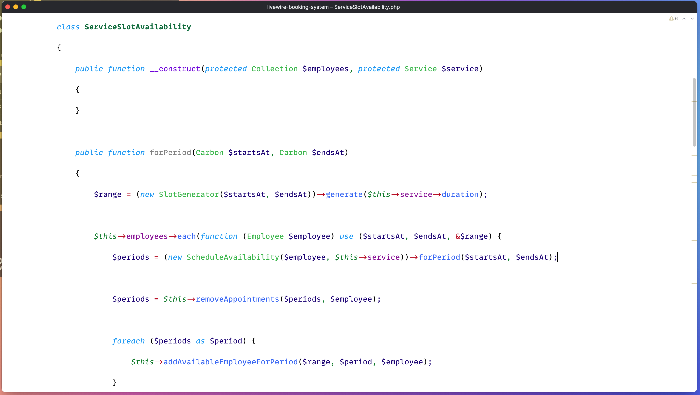

# Artisan – A Light Colour Scheme for PhpStorm

## Installation

In PhpStorm, go to `Settings > Editor > Color Scheme`, press the little cog next to the scheme selector, and choose `Import Scheme`.

## Contributing

This theme is still a work in progress. Feel free to send PRs and open issues.
